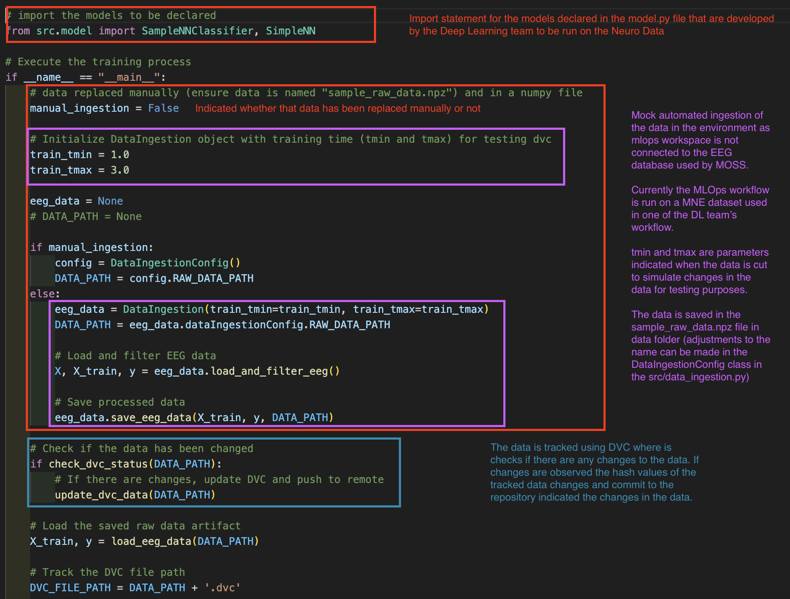
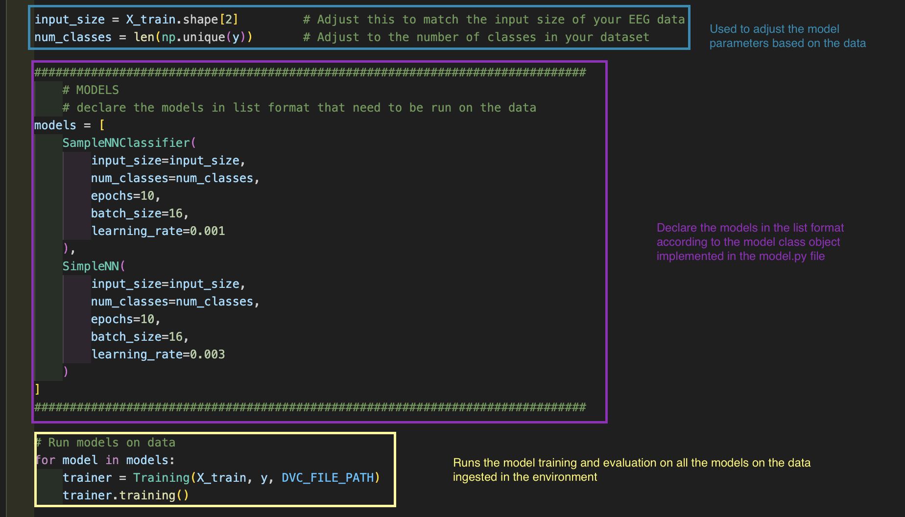
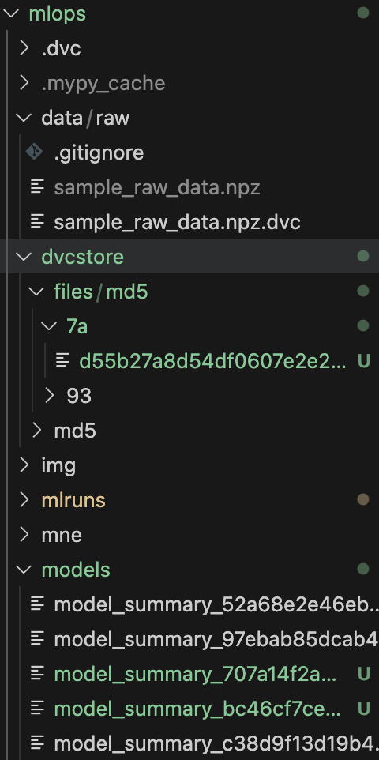
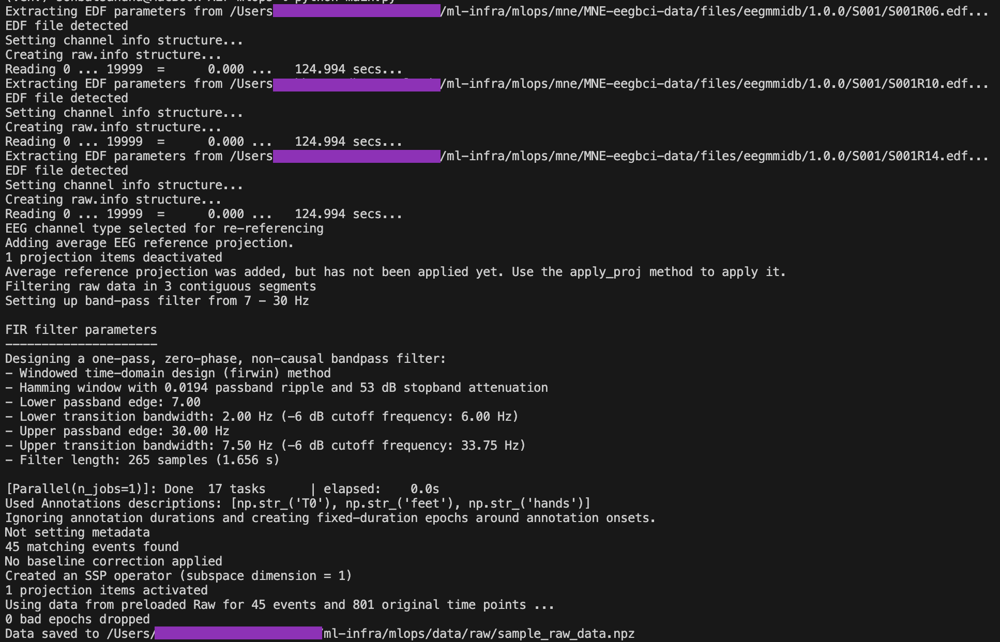
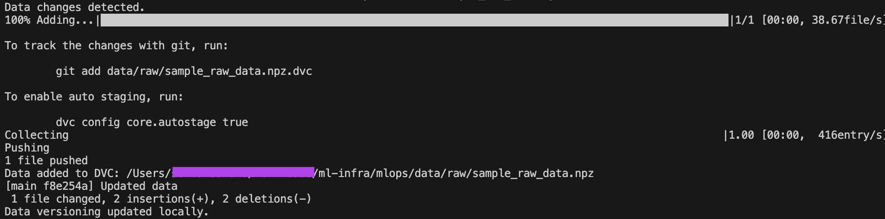
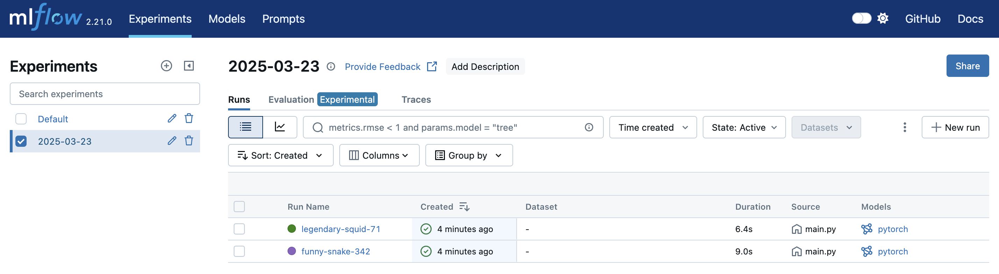

# MINT MOSS Infrastructure and MLOps 

Developing infrastructure and MLOps tools for MINT MOSS.

## Setup and Installation
### Prerequisites
* Python 3.12
* Latest [Anaconda Distribution](https://docs.anaconda.com/anaconda/install/) or [Miniconda](https://docs.anaconda.com/miniconda/miniconda-install/) Installed
    * **NOTE:** If unsure which one to install, see [this](https://docs.anaconda.com/distro-or-miniconda/).

### Set up Workspace

#### Fork this repository:

* Navigate to the GitHub repository.
* Click on the "Fork" button in the top-right corner.
* Clone the forked repository to your local machine and change working directory:
 ```
$ git clone https://github.com/UBCMint/ml-infra.git
$ cd ml-infra
```

#### Create and Activate Conda Environment

```
$ conda create -p venv python=3.13 -y
$ conda activate venv/
```

#### Install the required packages and dependencies:

```
$ pip install -r requirements.txt
```

## Workflow

`main.py` file consists of the main code that can be tweaked by the deep learing team to use the mlops tool effectively.


### Data Ingestion

The data can be ingested into the system manually or through an script that downloads the data from an MNE dataset.



All the models declared as classes in the `model.py` file using the model workflow mentioned in the next section  can be run on the ingested data. (see below)



**AFTER A SUCCESSFUL RUN YOU WILL OBSERVE THE POTENTIAL CHANGES IN THE FOLLOWING FILES:**



Where:
- `dvcstore` contains the data as stored using DVC labelled using the hash value generated by dvc (remember using GitHub to store highly volumnious data like EEG is bad practice as they have limited space on the repository other remote storages should be considered)
- `mlruns` consists of the meta-data for the ML runs used by MLFlow for their UI.
- `models` contains the text files with basic model information. For example `model_summary_707a14f2a5694bbc96a56fe2498224a8.txt` contains:
    ```
    =================================================================
    Layer (type:depth-idx)                   Param #
    =================================================================
    SampleNNClassifier                       --
    ├─Linear: 1-1                            5,184
    ├─Linear: 1-2                            528
    ├─Linear: 1-3                            34
    ├─Dropout: 1-4                           --
    ├─CrossEntropyLoss: 1-5                  --
    ├─MulticlassAccuracy: 1-6                --
    =================================================================
    Total params: 5,746
    Trainable params: 5,746
    Non-trainable params: 0
    =================================================================
    ```

### Model Workflow

The model should be declared in `model.py` file as a class.

```
class DocNN(nn.Module):
    """
    A PyTorch Simple NN model for classifying EEG data.

    Attributes:
        model (torch.nn.Module): The neural network architecture for classification.
        loss_criterion (torch.nn.Module): The loss function used during training.
        accuracy (torchmetrics.Metric): The accuracy metric for evaluating the model.
        learning_rate (float): The learning rate for the optimizer.
    """
    def __init__(self, input_size, num_classes, epochs, batch_size, learning_rate):
        """
        Initializes the SimpleNN.

        Args:
            input_size (int): The size of each input sample.
            num_classes (int): The number of output classes for classification.
            epochs (int): The number of passes on the training data.
            batch_size (int): The size of batch for training and evaluating model
            learning_rate (float): The learning rate for the optimizer (default is 0.001).
        """
        super().__init__(input_size, num_classes)
        self.input_size, self.num_classes = input_size, num_classes
        
        # Layers
        super().__init__()
        <DECLARE-ARCHITECTURE>
        
        # Configure parameters
        self.epochs, self.batch_size, self.learning_rate = epochs, batch_size, learning_rate
        # Declare Loss Function
        self.loss_criterion = <LOSS-FUNCTION>.to(device='cpu')
        # Declare metrics function
        self.metrics_fn = <METRICS-FUNCTION>.to(device='cpu')
        # Instantiate optimizer
        self.configure_optimizers()

    # defines the flow of data from one layer to another in the neural network
    def forward(self, x):
        """
        Defines the forward pass of the model.

        Args:
            x (torch.Tensor): Input tensor containing EEG data.

        Returns:
            torch.Tensor: Model output after processing the input.
        """
        x = torch.relu(self.fc1(x))
        <FORWARD-FLOW>
        return x
    
    def training_step(self, batch):
        """
        Performs a single training step.

        Args:
            batch (tuple): A batch of data containing input features and labels.

        Returns:
            torch.Tensor: The calculated loss for the batch.
            torch.Tensor: The calculated accuracy for the batch.
        """
        inputs, labels = batch
        
        # Forward pass
        outputs = self(inputs)[:, -1, :]
        loss = self.loss_criterion(outputs, labels)
        acc = self.accuracy(outputs, labels)
        
        # Zero the parameter gradients
        self.optimizer.zero_grad()
        
        # Backward pass and optimize
        loss.backward()
        self.optimizer.step()

        return loss, acc
    
    def validation_step(self, batch):
        """
        Performs a single validation step.

        Args:
            batch (tuple): A batch of validation data containing input features and labels.

        Returns:
            torch.Tensor: The calculated loss for model evaluation.
            torch.Tensor: The calculated accuracy for model evaluation.
        """
        inputs, labels = batch
        outputs = self(inputs)[:, -1, :]
        val_loss = self.loss_criterion(outputs, labels).item()
        val_acc = self.accuracy(outputs, labels)
        
        return val_loss, val_acc
        
    def configure_optimizers(self):
        """
        Configures the optimizer for the training process.

        Returns:
            None
        """
        self.optimizer = optim.Adam(self.parameters(), lr=self.learning_rate)
```

### MLflow

#### Running the script for ML jobs

The script uses the MLflow Tracking API. For instance, run from the mlops directory of your workspace:
```
python main.py
```
This program will use [MLflow Tracking API](https://mlflow.org/docs/latest/tracking.html), which logs tracking data in ./mlruns. This can then be viewed with the Tracking UI.

**MNE DATA INGESTION CONSOLE OUTPUT:**



**DVC & Git Push/Commit:**

Changes detected in the data results in a `dvc push` to track the data and a corresponding push of the `.dvc` file to github.



**SAMPLE CONSOLE OUTPUT:**

```
2025/03/23 13:06:50 INFO mlflow.tracking.fluent: Experiment with name '2025-03-23' does not exist. Creating a new experiment.
=================================================================
Layer (type:depth-idx)                   Param #
=================================================================
SampleNNClassifier                       --
├─Linear: 1-1                            5,184
├─Linear: 1-2                            528
├─Linear: 1-3                            34
├─Dropout: 1-4                           --
├─CrossEntropyLoss: 1-5                  --
├─MulticlassAccuracy: 1-6                --
=================================================================
Total params: 5,746
Trainable params: 5,746
Non-trainable params: 0
=================================================================
Epoch 1
-------------------------------
loss: 0.688444 accuracy: 0.562500 [0 / 3]
loss: 0.700623 accuracy: 0.437500 [1 / 3]
loss: 0.683964 accuracy: 0.615385 [2 / 3]
Eval metrics: 
Accuracy: 0.54, Avg loss: 0.690676 

Epoch 2
-------------------------------
loss: 0.682543 accuracy: 0.625000 [0 / 3]
loss: 0.706053 accuracy: 0.375000 [1 / 3]
loss: 0.683061 accuracy: 0.615385 [2 / 3]
Eval metrics: 
Accuracy: 0.53, Avg loss: 0.691070 

Epoch 3
-------------------------------
loss: 0.688655 accuracy: 0.562500 [0 / 3]
loss: 0.694673 accuracy: 0.500000 [1 / 3]
loss: 0.690455 accuracy: 0.538462 [2 / 3]
Eval metrics: 
Accuracy: 0.53, Avg loss: 0.691515 

Epoch 4
-------------------------------
loss: 0.681883 accuracy: 0.625000 [0 / 3]
loss: 0.687625 accuracy: 0.562500 [1 / 3]
loss: 0.705911 accuracy: 0.384615 [2 / 3]
Eval metrics: 
Accuracy: 0.54, Avg loss: 0.690504 

Epoch 5
-------------------------------
loss: 0.706822 accuracy: 0.375000 [0 / 3]
loss: 0.681803 accuracy: 0.625000 [1 / 3]
loss: 0.683742 accuracy: 0.615385 [2 / 3]
Eval metrics: 
Accuracy: 0.54, Avg loss: 0.690020 

Epoch 6
-------------------------------
loss: 0.700995 accuracy: 0.437500 [0 / 3]
loss: 0.694622 accuracy: 0.500000 [1 / 3]
loss: 0.674574 accuracy: 0.692308 [2 / 3]
Eval metrics: 
Accuracy: 0.54, Avg loss: 0.690013 

Epoch 7
-------------------------------
loss: 0.687633 accuracy: 0.562500 [0 / 3]
loss: 0.694537 accuracy: 0.500000 [1 / 3]
loss: 0.691185 accuracy: 0.538462 [2 / 3]
Eval metrics: 
Accuracy: 0.53, Avg loss: 0.690981 

Epoch 8
-------------------------------
loss: 0.681148 accuracy: 0.625000 [0 / 3]
loss: 0.701713 accuracy: 0.437500 [1 / 3]
loss: 0.690149 accuracy: 0.538462 [2 / 3]
Eval metrics: 
Accuracy: 0.54, Avg loss: 0.689909 

Epoch 9
-------------------------------
loss: 0.681397 accuracy: 0.625000 [0 / 3]
loss: 0.708652 accuracy: 0.375000 [1 / 3]
loss: 0.681542 accuracy: 0.615385 [2 / 3]
Eval metrics: 
Accuracy: 0.53, Avg loss: 0.690947 

Epoch 10
-------------------------------
loss: 0.687228 accuracy: 0.562500 [0 / 3]
loss: 0.695213 accuracy: 0.500000 [1 / 3]
loss: 0.689718 accuracy: 0.538462 [2 / 3]
Eval metrics: 
Accuracy: 0.54, Avg loss: 0.690389
```
#### Launching the Tracking UI

The MLflow Tracking UI will show runs logged in ./mlruns at http://localhost:5000. Start it with:
```
mlflow ui
```

**EXPERIMENT DETAILS**

You will be redirected to the UI on local host with the following sample output:



On the left you are able to observe a experiment based on the day it was conducted. On the right you will be able to observe all the models with runs on the corressponding data. As there were two sample models (`SimpleNN` & `SampleNNClassifier`), you can observe two ML runs. 

**ML RUN DETAILS**

To get more details click on the **Run Name** and you get the following output:


You will get the general details under the `details` sections, the logged parameters in the `parameter` section and the metrics logged under the `metric` sections.

**METRICS VISUALIZATION**

To observe the evaluations click on one of the metrics (like the `eval_loss` indication the evaluation loss)


#### Register a Model

Use the MLflow Model Registry UI to effectively manage and organize machine learning models.

Follow the steps in [Mlflow UI Workflow](https://mlflow.org/docs/latest/model-registry.html#ui-workflow) to register models in MLflow Registry.

**NOTES:** 
- To simulate model versioning, the [model.py file](https://github.com/UBCMint/ml-infra/blob/main/src/model.py) includes two models **SampleNNClassifier** and **SimpleNN**. The model summary is stored in the models directory as well logged as a artifact using mlflow.
- In [train.py](https://github.com/UBCMint/ml-infra/blob/main/src/train.py), make sure to create the model object, define loss function etc

### DVC

#### Tracking data

Working inside an initialized project directory, use the `add dvc` command to start tracking the dataset file ( with path <DATASET-FILE-PATH>, directory <DATASET-FILE-DIR> and name <DATASET-FILE-NAME>)

```
$ dvc add <DATASET-FILE-NAME>
```

DVC stores information about the added file in a special .dvc file named  <DATASET-FILE-NAME>.dvc. This small, human-readable metadata file acts as a placeholder for the original data for the purpose of Git tracking. This file contains a 'md5' hash value that uniquely identifies a dataset. 

Next, run the following commands to track changes in Git:
```
$ git add  <DATASET-FILE-NAME>.dvc <DATASET-FILE-DIR>/.gitignore
$ git commit -m <COMMIT-MESSAGE>
```

The data version or file can can be found be in the <.../ml-infra/.dvc/cache/files/md5>.